<div align="center">

# 🔍 AI Investigator

**Autonomous investigation platform powered by GitHub Copilot**

An agentic system that runs, monitors, and learns from pipeline investigations — complete with live KQL execution, real-time streaming, and a self-improving knowledge base.

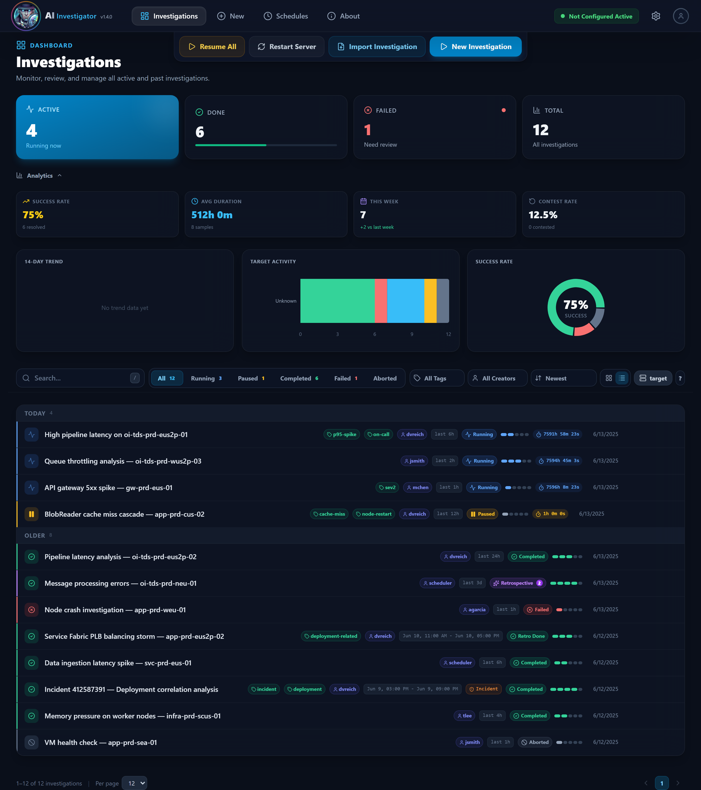

</div>

---

## Table of Contents

- [Overview](#overview)
- [Visual Walkthrough](#visual-walkthrough)
- [Features](#features)
- [Architecture](#architecture)
- [Getting Started](#getting-started)
- [Remote Access](#remote-access)
- [Configuration](#configuration)
- [API Reference](#api-reference)
- [Tech Stack](#tech-stack)
- [Project Structure](#project-structure)
- [Taking Screenshots](#taking-screenshots)

---

## Overview

AI Investigator is a full-stack web application that orchestrates LLM-driven investigations. An agent reasons about the problem, executes KQL queries against live Kusto clusters, and produces structured investigation reports — all visible in real-time through a modern UI.

After each investigation, a **retrospective system** analyzes what went well and what didn't, then proposes concrete file changes to the knowledge base so the next investigation is smarter.

### Key Capabilities

| Capability | Description |
|------------|-------------|
| **Agentic Investigation** | LLM-driven think → act → observe loop with autonomous KQL execution |
| **Live Streaming** | WebSocket-powered real-time display of agent thoughts, tool calls, and results |
| **Dual KQL Backend** | Kusto CLI (primary) with MCP KQL Server fallback — auto-detects and auto-installs |
| **Full Lifecycle Control** | Start, pause, resume, abort, intervene, contest — all while the agent is running |
| **Bulk Resume & Server Restart** | Resume all paused investigations in one click; restart the backend server from the UI with automatic reconnection |
| **Retrospective Analysis** | Post-investigation AI analysis that reads the knowledge base and proposes improvements |
| **Proposal Workflow** | Review, approve, reject, and apply file changes directly from the UI |
| **Persistent History** | All investigations saved as JSON state + Markdown reports, survives server restarts |
| **Share & Export** | Export investigations as JSON files for sharing; import them on any dashboard instance with file picker or drag-and-drop |
| **PDF Reports** | One-click PDF export of final reports with styled Markdown rendering via Puppeteer |
| **ICM Integration** | Start investigations from IcM incidents with auto-extracted context (stamp, time range, severity) |
| **Scheduled Investigations** | Recurring automated health checks with configurable intervals, verdict tracking, and run history |
| **Query Bank** | Save and reuse investigation configurations as named templates across forms and schedules |
| **Dashboard Analytics** | Interactive charts — investigation trend, issue type donut, duration histogram, and success rate |
| **Multi-Product Support** | Configure multiple investigation targets with independent paths, prompts, and knowledge bases |

---

## Visual Walkthrough

<!-- ### 1. Dashboard

The main dashboard shows all investigations as color-coded cards with live status, duration timers, and retrospective badges.

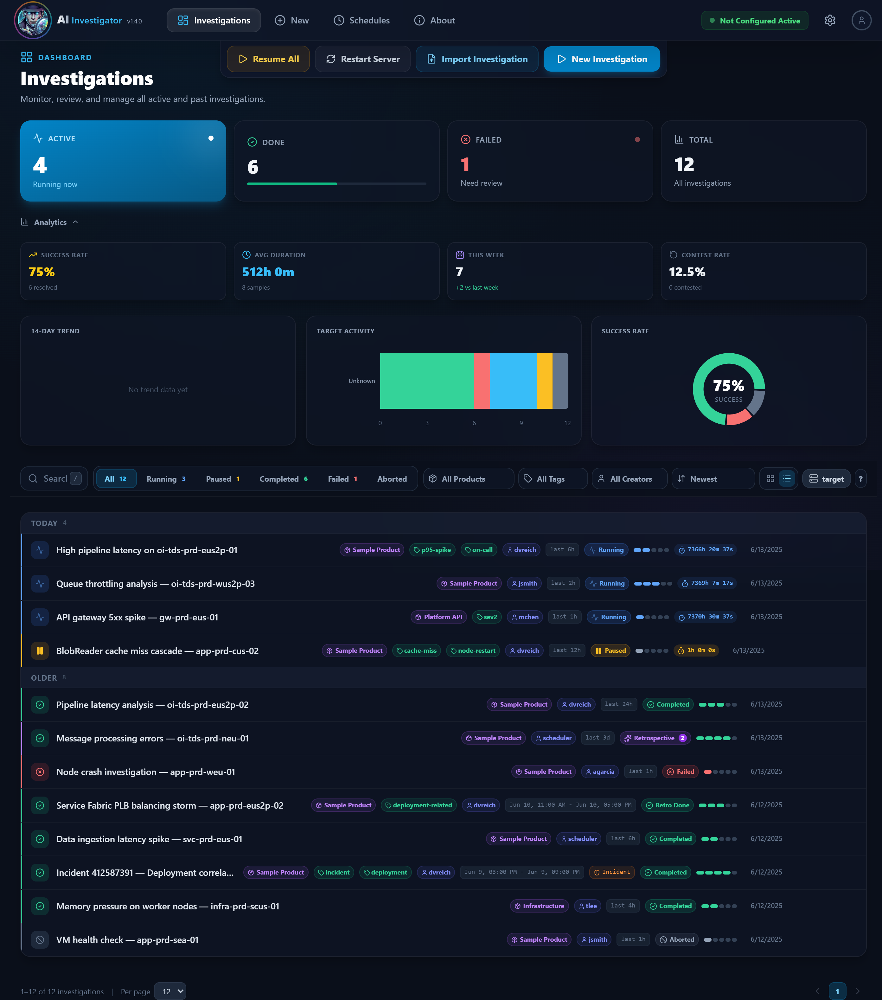

Screenshot: The investigation cards grid showing a mix of running (blue pulse), completed (green), and failed (red) investigations. The stats bar at the top shows Active / Completed / Failed counts. -->

---

### 1. New Investigation

Launch investigations with structured context: stamp name, issue type, time window (8 quick presets or custom range), and model selection. Toggle between **Standard** and **ICM Incident** modes to start from an incident ID with auto-extracted context.

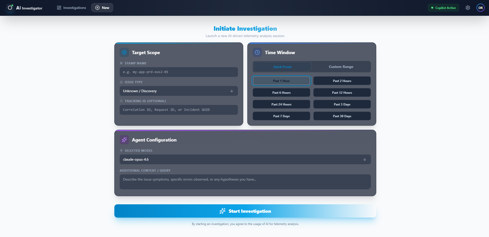

<!-- Screenshot: The full form with Target Scope (stamp, issue type dropdown, tracking ID), Time Window section with preset buttons, and Agent Configuration with model selector. -->

---

### 2. Investigation Start

Once launched, the investigation begins with the agent initializing and preparing to execute the task.

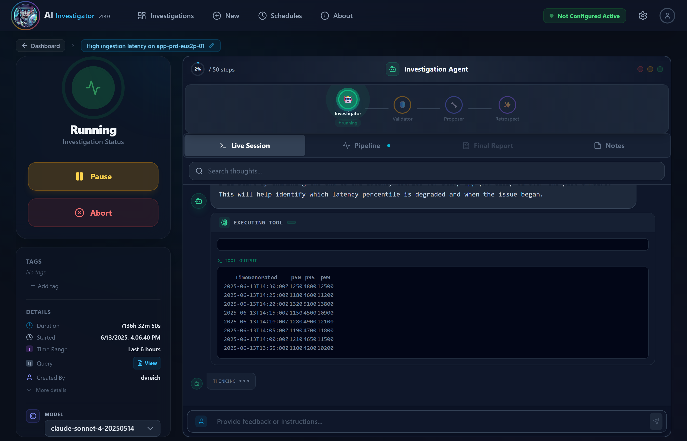

<!-- Screenshot: The initial state of a running investigation showing the agent starting its work. -->

---

<!-- ### 3. Live Session

Watch the agent think and act in real-time. Each step shows the agent's reasoning (rendered Markdown) and tool executions with full arguments and results.

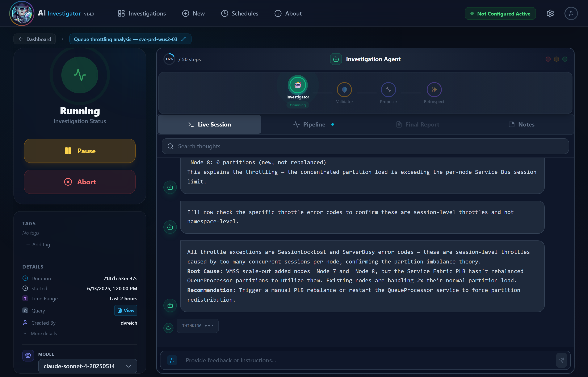

Screenshot: An active investigation showing several thought bubbles and tool call results (KQL queries with table output). The sidebar shows investigation metadata.

--- -->

---

### 3. Paused Investigation

Pause a running investigation at any time to review progress or prepare for intervention.

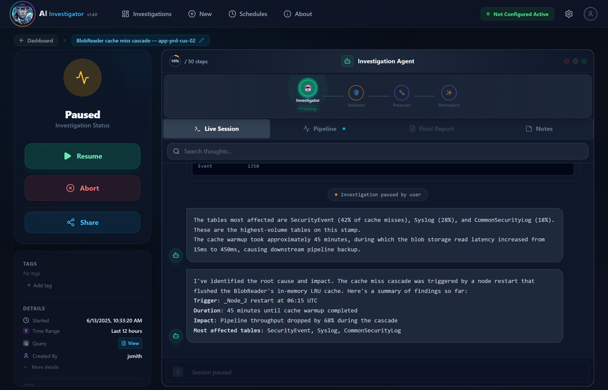

<!-- Screenshot: The investigation in paused state with the pause control visible. -->

---

### 4. User Intervention

Inject custom instructions to a running investigation to guide the agent in a specific direction or provide additional context without pausing.

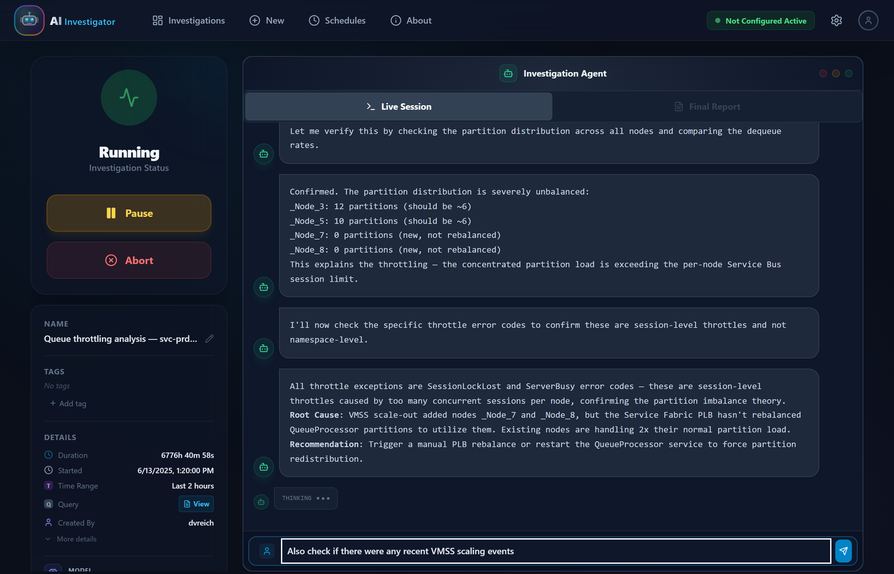

<!-- Screenshot: The intervention input interface where users can type instructions to redirect the agent while it's running. -->

---

### 5. Contest Report

Disagree with the final report? Click **Contest Report** at the bottom of the Report tab, provide your feedback, and the investigation resumes — the agent re-examines its findings with your corrections.

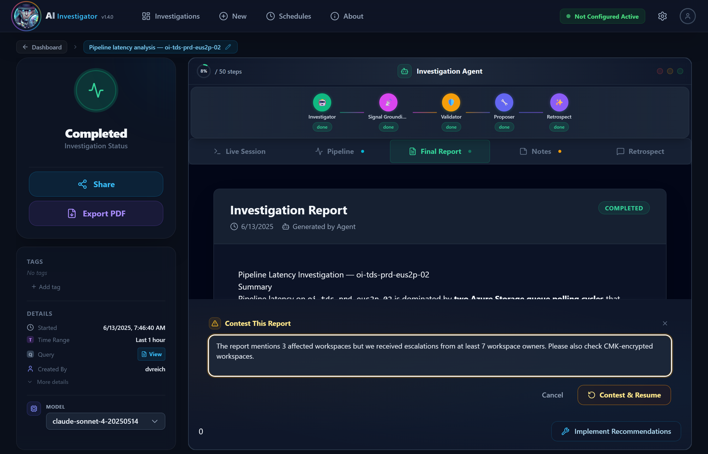

---

### 6. Investigation Resumed After Contest

After contesting, the Live Session shows your feedback as an amber user bubble and a system notification. The agent acknowledges the feedback and continues investigating.

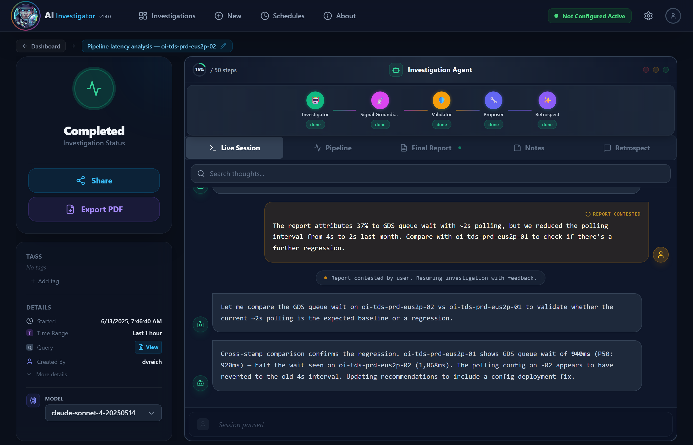

---

<!-- ### 7. Token Management

When the context window fills up, a banner appears with a one-click Summarize button that compacts history while preserving recent context.

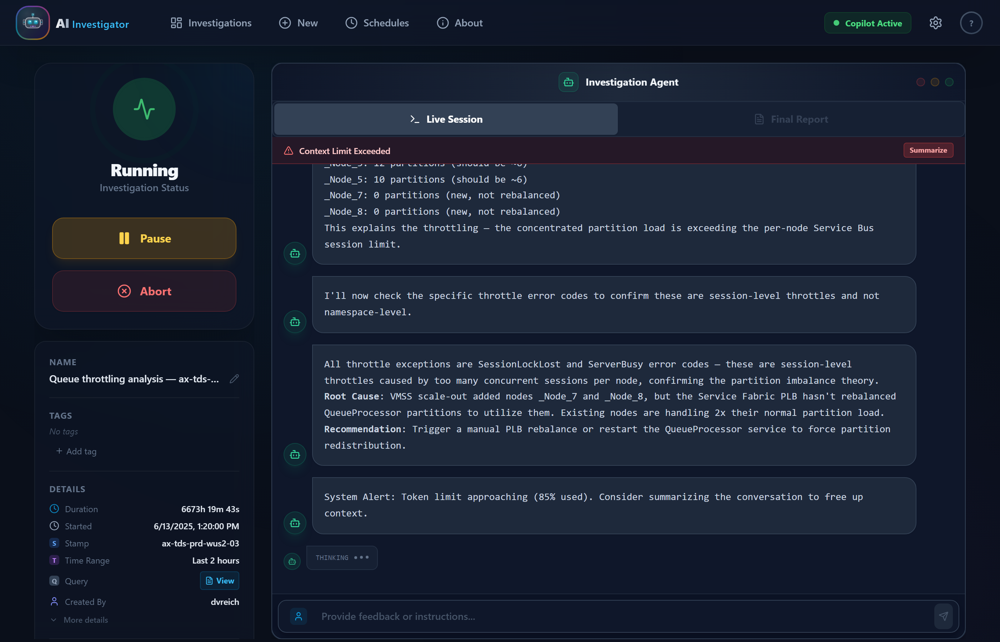

Screenshot: The yellow/amber token alert banner at the top of the live session with the "Summarize" button.

--- -->

---

### 7. Final Report

Auto-generated Markdown report with findings, KQL queries used, and conclusions — styled with prose typography.

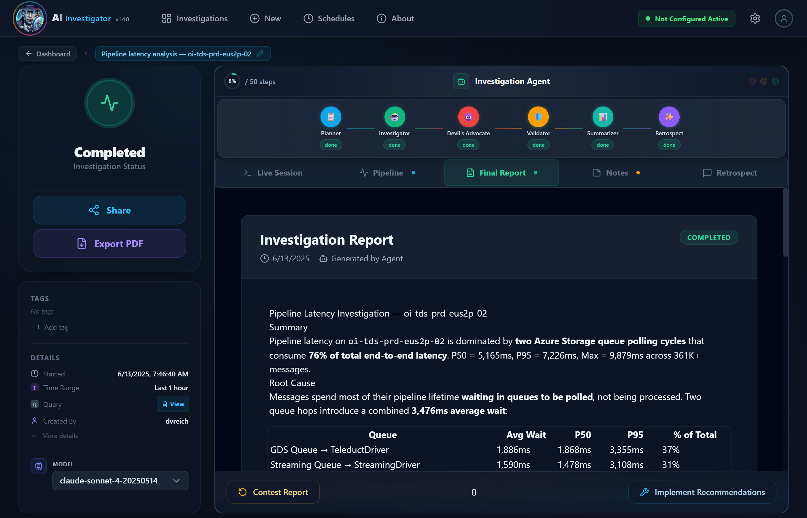

<!-- Screenshot: The Report tab showing a rendered Markdown report with headers, bullet points, and KQL code blocks. -->

---

### 8. Failed Investigation

When an investigation encounters unrecoverable errors (consecutive LLM failures, KQL tool disconnection), it transitions to a failed state with preserved context for debugging.

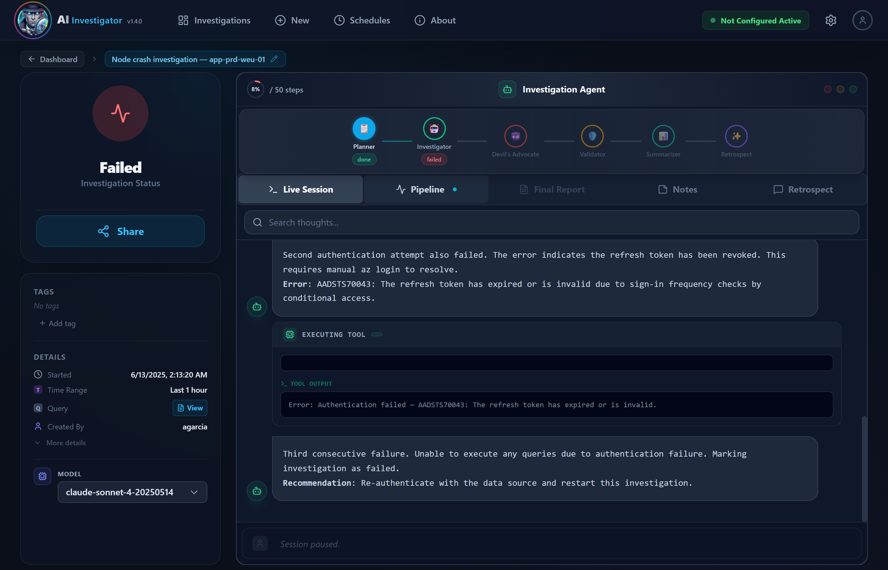

---

### 9. Retrospective — Auto-Analysis

When you open the Retrospect tab, an AI agent automatically reads the investigation transcript and knowledge base files, then proposes improvements.

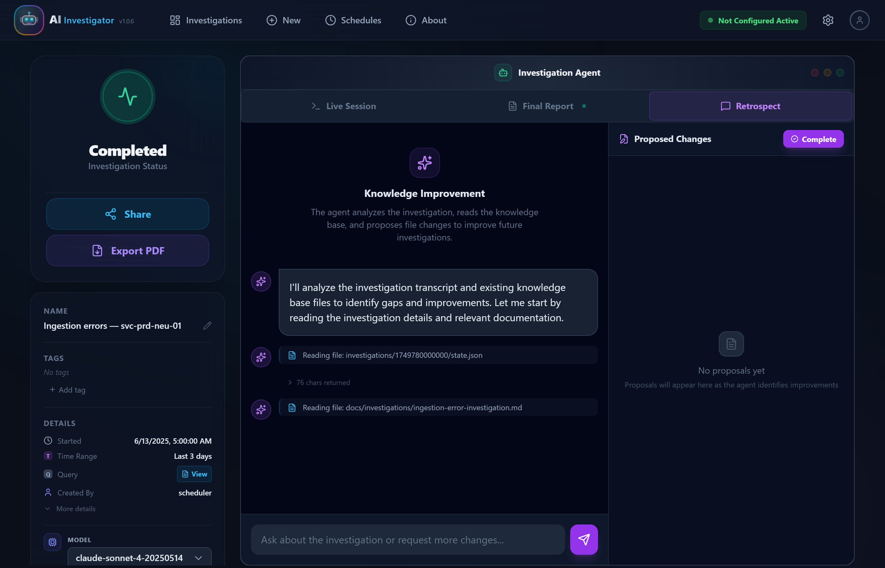

<!-- Screenshot: The split-panel Retrospect view. Left side: the analysis chat showing "Analyzing & Reading Files" progress with tool activity indicator. Right side: the Proposed Changes panel (can be empty during analysis). -->

---

### 10. Retrospective — Knowledge Base Analysis

The retrospective agent reads the investigation transcript and existing knowledge base files, then identifies gaps and proposes new documentation.

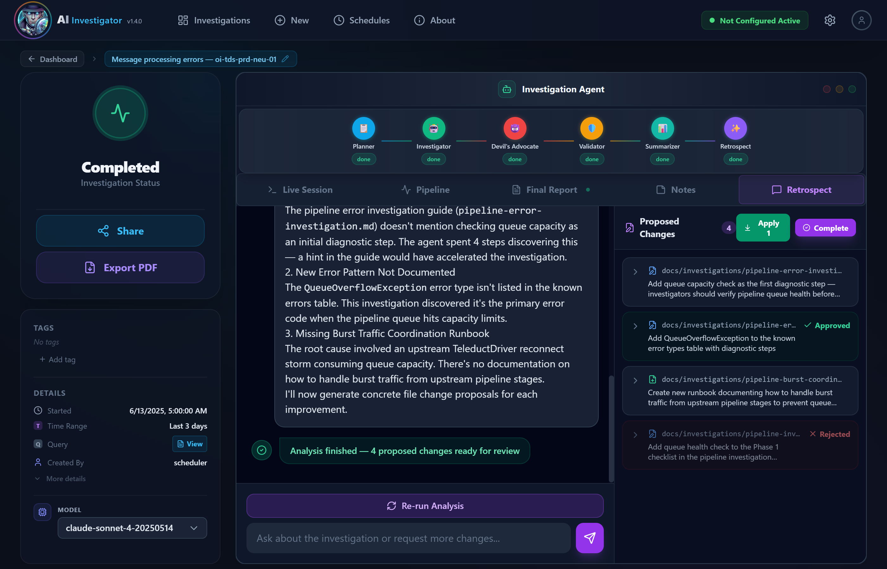

<!-- Screenshot: The retrospective agent analyzing the investigation and proposing to create a new knowledge base file (e.g., "Teleduct General Error Discovery Guide"). Shows the chat conversation with the agent's reasoning. -->

---

### 11. Retrospective — Proposed Changes

The agent proposes concrete file changes (edit existing or create new). Review each proposal, approve or reject, then apply all approved changes to disk.

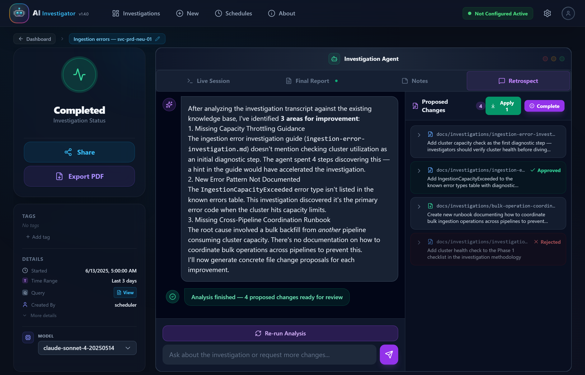

<!-- Screenshot: The right panel with 3-5 proposals expanded. Show the approve/reject buttons, the "Apply 3" button in the header, and at least one expanded proposal showing the change description. If possible, show a mix of approved (green check) and pending proposals. -->

---

<!-- ### 12. Retrospective — Conversational Follow-up

After auto-analysis, continue chatting with the retrospective agent to explore additional improvements.

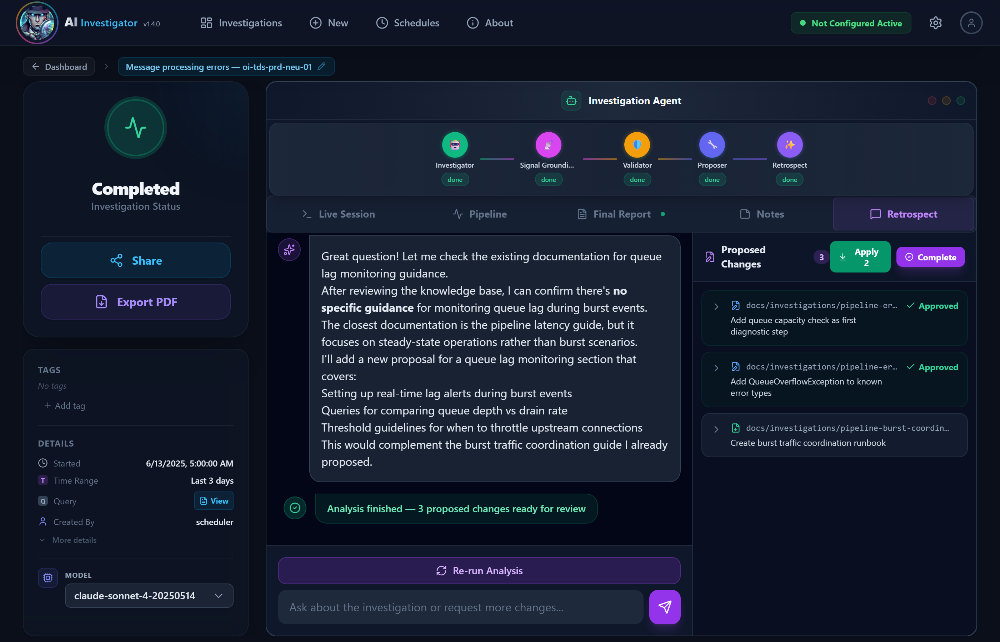

Screenshot: The chat panel with the auto-analysis message, followed by a user question and an agent response.

--- -->

---

### 12. Settings

Configure agent behavior, model selection, investigation storage path (with server-side file browser), and system defaults across four tabs: Products, Agent Behavior, Appearance, and System.

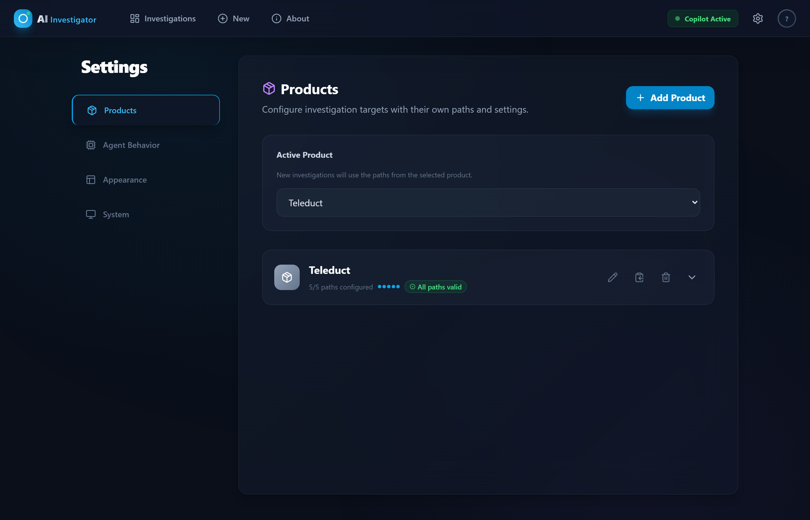

<!-- Screenshot: The Settings page showing the Agent Behavior tab with the model selector, max steps slider, and file browser for the investigations path. -->

---

### 13. Resume All After Server Restart

When the backend restarts, all running investigations are automatically paused. The dashboard shows a **Resume All** button with the count of paused investigations. Click it to resume them all at once (respecting the max concurrent limit). A separate **Restart Server** button lets you trigger a graceful restart directly from the UI.

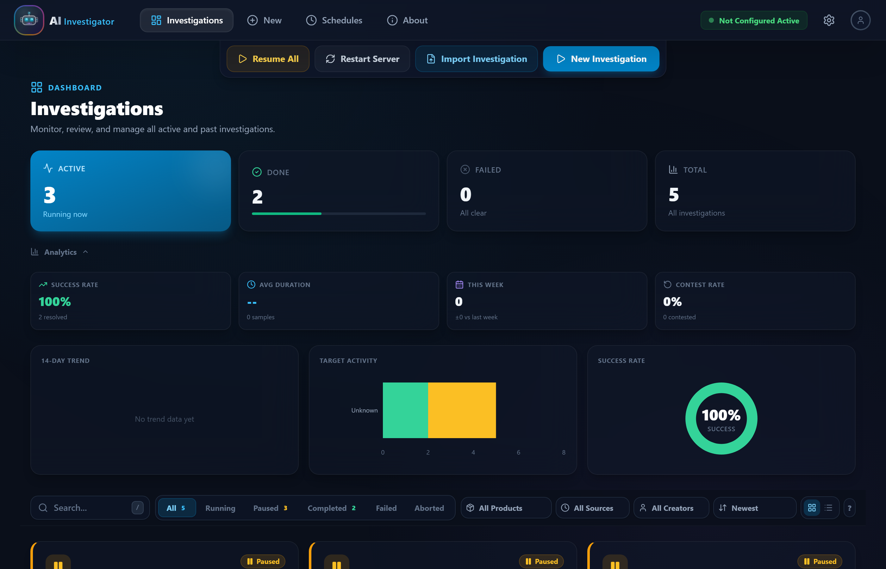

<!-- Screenshot: The dashboard header showing the amber "Resume All (3)" button and the "Restart Server" button next to "Start New Investigation". Three investigation cards show paused status with server restart notices. -->

---

### 14. Share & Export

Non-running investigations show **Share** (sky-blue) and **PDF** (violet) buttons in the sidebar. Share exports the full investigation state as a JSON file; PDF renders the final report into a styled, downloadable PDF document via Puppeteer.

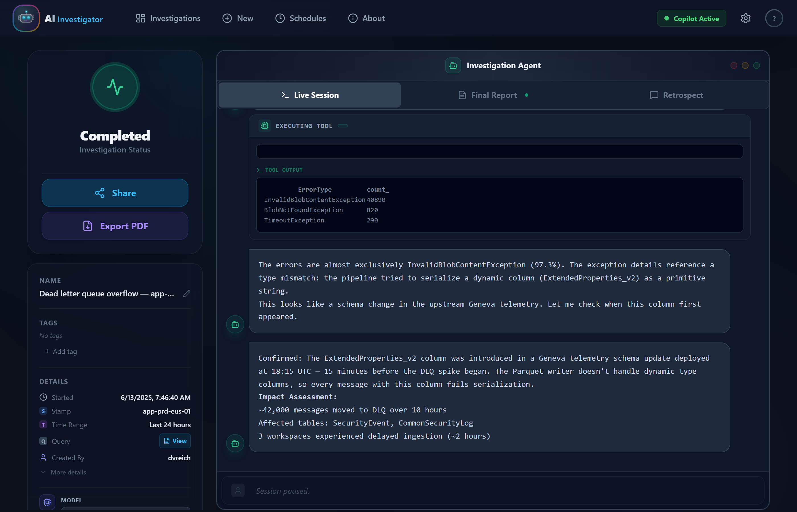

<!-- Screenshot: The investigation detail sidebar showing the Share (sky-blue) and PDF (violet) export buttons alongside pause/resume controls. -->

---

### 15. Import Investigation (Drag & Drop)

Import previously exported investigations via the **Import Investigation** button in the floating action dock, or simply drag and drop a `.json` file anywhere on the dashboard. A full-screen animated drop zone appears with gradient borders and a pulsing upload icon.

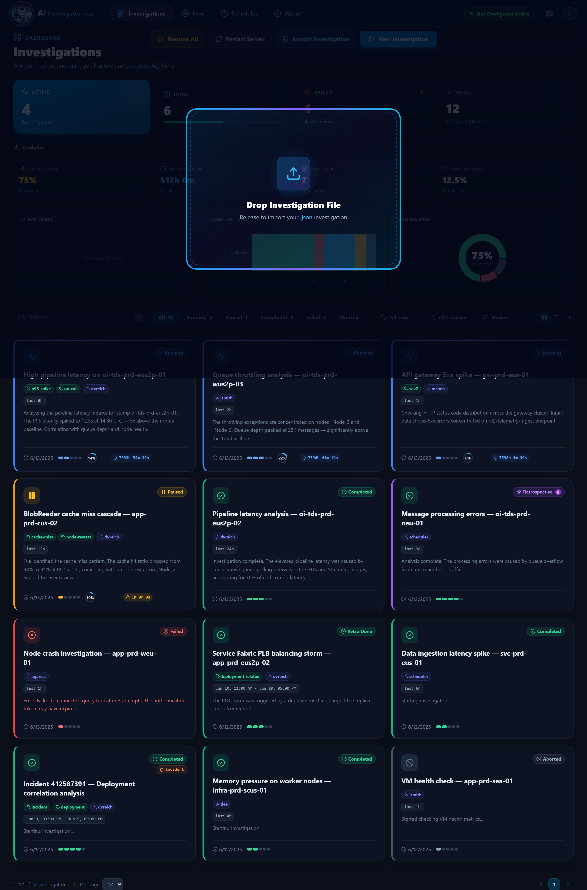

<!-- Screenshot: The full-screen drag-and-drop overlay with the animated upload icon, gradient border, and "Drop Investigation File" text. -->

---

### 16. Scheduled Investigations

Set up recurring automated health checks with configurable intervals. The Schedules page shows all schedules as cards with live verdict badges (healthy / warning / critical / error), next-run countdown, and full run history. A floating dock lets you start/stop the scheduler and create new schedules.

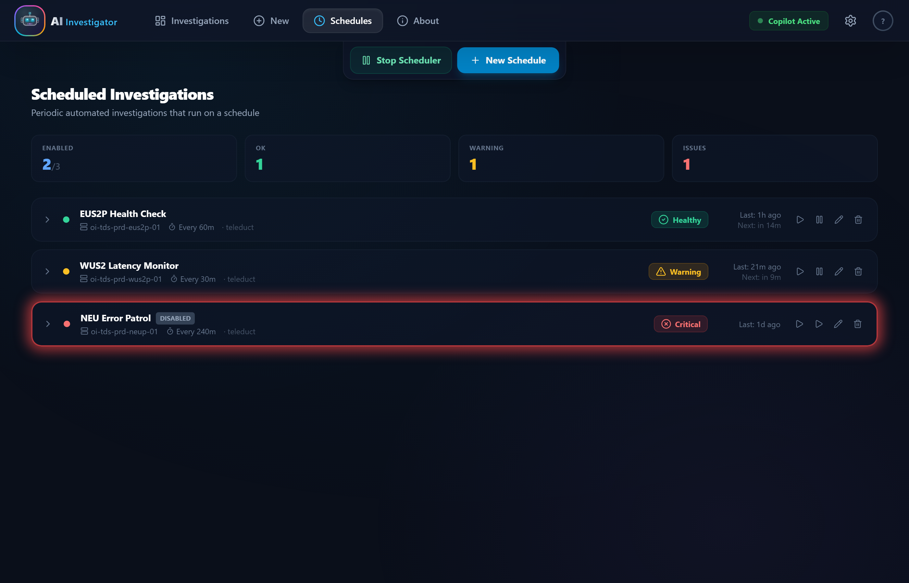

---

### 17. New / Edit Schedule

Create or edit a schedule with a multi-step wizard: choose a saved query from the Query Bank or configure from scratch — stamp, issue type, time range, model, max steps, and recurrence interval (5min to 24h). The form defaults to settings from your active product.

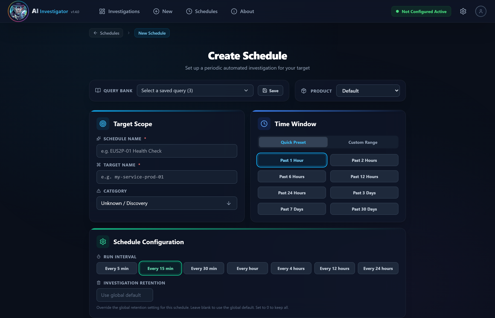

---

### 18. Query Bank

Save investigation configurations as reusable templates. Access the Query Bank from the New Investigation form to instantly load a saved stamp, query, time range, issue type, and model — or use them when creating schedules.

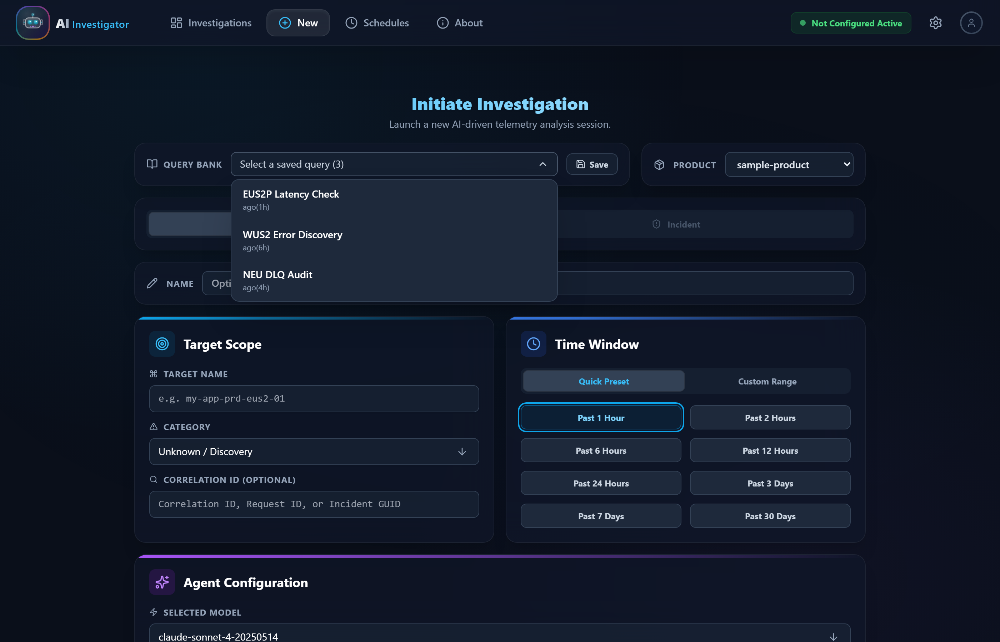

---

<!-- ### 13. GitHub Copilot Authentication

Secure OAuth device flow — enter the code on GitHub, and you're connected.

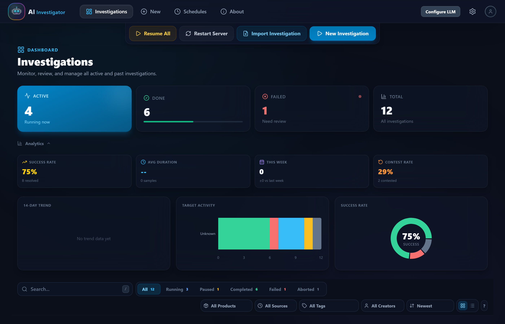

Screenshot: The login modal showing the device code and "Open Login Page" button. Also show the green "Connected" indicator in the header after login.

--- -->

---

## Features

### 🔄 Investigation Lifecycle

- **Create** — Define stamp, time range (8 presets or custom datetime), issue type, tracking ID, model selection, and free-text query. Issue types: Unknown/Discovery, Latency/Performance, Error/Failure Rate, Throttling/Quota, Data Loss/Inconsistency, Availability/Downtime
- **Flexible Timestamps** — Custom time range accepts ISO 8601, US date formats (`MM/DD/YYYY HH:MM AM/PM`), and Unix timestamps (seconds or milliseconds) with real-time validation and calendar picker
- **Form Defaults** — Model and time range preset are pre-populated from saved settings
- **Run** — Autonomous think → act → observe loop with KQL execution against live Kusto clusters
- **Pause / Resume** — Freeze the agent, inspect state, optionally switch models, then continue
- **Intervene** — Inject messages into the running agent's context to redirect its approach
- **Contest Report** — Disagree with the final report? Provide feedback and the investigation resumes, the agent re-examines its findings and produces an improved report. Only available on `completed` investigations; the Retrospect tab appears for completed, failed, or aborted investigations
- **Abort** — Stop immediately with state preserved
- **Delete** — Remove investigation from memory and disk with confirmation prompt
- **Rename** — Inline title editing directly from the dashboard
- **Max Steps** — Configurable safety limit (auto-pauses at threshold, resume for another batch)
- **Model Switching** — Change the LLM model mid-investigation (even while paused)
- **Contest Tracking** — Tracks the number of times a report is contested, giving the agent cumulative feedback context

### 🎫 ICM Incident Integration

Start investigations directly from an IcM incident — the system auto-extracts all relevant context:

- **Two Investigation Modes** — Toggle between **Standard** (stamp + time range + issue type) and **ICM Incident** (enter incident ID) in the New Investigation form
- **Auto-Context Extraction** — Fetches the incident via SSE streaming, extracts stamp name, time range, severity, title, owning team, and description
- **Progress Visualization** — Real-time step-by-step progress display during ICM data fetch
- **Auto-Fill** — Extracted metadata auto-populates investigation form fields (including incident status, individual owner, and severity badge)
- **Status Check** — Validates ICM scripts are configured and available before allowing ICM mode
- **Playwright Dependency** — Setup script installs Playwright for ICM browser automation when scripts are detected

### 🔍 KQL Execution (Dual Backend)

| Backend | Role | Details |
|---------|------|---------|
| **Kusto CLI** | Primary | Auto-detects `Kusto.Cli.exe` in PATH, `C:\Kusto`, or NuGet cache. Auto-installs from NuGet if missing. Parses TSV output to structured JSON. |
| **MCP KQL Server** | Fallback | Python-based Model Context Protocol server. Auto-installs via pip. 3-minute startup timeout for Azure auth. |

Both backends support: `execute_kql_query`, `list_tables`, `discover` (table schema), `refresh_schema`.

**Destructive Command Blocking** — Kusto CLI blocks dangerous commands (`.drop`, `.delete`, `.purge`, `.alter`, etc.) to prevent accidental data loss.

### 🛠️ Agent Tools

The investigation agent has access to these tools:

| Tool | Description |
|------|-------------|
| `execute_kql_query` | Run KQL queries with cluster URL and database parameters |
| `schema_memory` | Schema operations: `list_tables`, `discover` (table schema), `refresh_schema` |
| `read_file` | Read file content from the repository (path-traversal protected, restricted to repo root) |
| `list_dir` | List directory contents (path-traversal protected) |
| `finish` | Complete the investigation with a structured summary and report |

The **retrospective agent** additionally has:

| Tool | Description |
|------|-------------|
| `propose_change` | Propose a file change with `type` (edit/create), `filePath`, `description`, and `content` |
| `read_file` | Read knowledge base files (capped at 12K chars per file, with deduplication) |
| `list_dir` | List directory contents |

### 📊 Real-Time Streaming

- **WebSocket Notifications** — The backend broadcasts lightweight event signals via WebSocket; the frontend debounces these into REST fetches for full state. This keeps the WS protocol thin while enabling real-time responsiveness
- Thought bubbles with Markdown rendering (headers, code blocks, tables via react-markdown + remark-gfm)
- Tool call display with arguments and formatted results (auto-collapsed at 2K+ chars, with “Load Full Output” for backend-truncated results)
- Status transitions broadcast instantly
- **WebSocket Reconnection** — Full-screen overlay on disconnect with exponential backoff (capped at 30s) and auto-reconnect
- **View Full Query Modal** — Click to expand investigation metadata (stamp, time range) and full query text with copy button

### 📋 Dashboard

The main dashboard provides a rich interface for managing all investigations:

- **Grid / List View** — Toggle between card grid and compact list layouts (persisted to localStorage)
- **Sort** — Order by Newest, Oldest, or Step Count
- **Filter by Status** — All, Running, Paused, Completed, Failed, Aborted
- **Filter by Product** — Dropdown to show only investigations for a specific product
- **Full-Text Search** — Search across stamp, title, issue type, incident ID, product name, investigation ID, and thought content. Matching text is highlighted in results
- **Pinning** — Pin important investigations to the top (persisted to localStorage)
- **Group by Stamp** — Toggle to cluster investigations by their stamp name
- **Date Grouping** — List view auto-groups into Today, Yesterday, This Week, and Older sections
- **Inline Rename** — Edit investigation titles directly from the card
- **Delete with Confirmation** — Remove investigations from memory and disk (blocked while running — abort first)
- **Inline Pause/Resume** — Hover over running/paused cards to toggle state without opening the detail view
- **Stale Detection** — Flags running investigations that haven't progressed in 5+ minutes
- **Toast Notifications** — Pop-up alerts when investigations complete or fail
- **Statistics Bar** — Four animated tiles: Active, Done, Failed, and Success Rate (percentage). Click any tile to filter the list
- **Keyboard Shortcuts** — Press `?` to toggle the shortcut overlay:
  | Key | Action |
  |-----|--------|
  | `/` | Focus search |
  | `j` / `↓` | Next card |
  | `k` / `↑` | Previous card |
  | `Enter` | Open selected |
  | `d` | Delete selected |
  | `g` | Switch to grid view |
  | `l` | Switch to list view |
  | `n` | New investigation |
  | `Esc` | Clear search |
- **Step Depth Bar** — Mini visualization of investigation step depth on each card
- **Retrospective Badges** — Visual indicators for retrospective status on cards
- **ICM Badge** — Orange badge on cards originating from IcM incidents
- **Product Labels** — Product name displayed on each investigation card
- **Live Duration Timer** — Running and paused cards show a live-counting elapsed-time timer
- **TrackingId Copy** — Abbreviated tracking IDs with click-to-copy
- **Skeleton Loading** — Animated placeholder cards during initial data fetch
- **Auto-Refresh** — Configurable polling interval (lightweight metadata-only polling)
- **Floating Action Dock** — Portal-rendered toolbar pinned below the navbar with quick actions:
  - **Resume All** — Batch-resume all paused investigations (shown only when paused count > 0)
  - **Restart Server** — Restart the backend server process
  - **Import Investigation** — Import a previously exported `.json` investigation file
  - **New Investigation** — Quick link to the investigation launch form

### 📤 Share, Export & Import

- **Export as JSON** — Download any non-running investigation as a portable `.json` file preserving full state, steps, and report
- **Export as PDF** — Generate a styled PDF report from the investigation's final Markdown report (requires Puppeteer). Available only for investigations with a completed report
- **Import Investigation** — Upload a previously exported JSON file to restore an investigation:
  - **File Picker** — Standard file dialog via the Import button in the action dock
  - **Drag & Drop** — Drag a `.json` file anywhere onto the dashboard to trigger a full-screen animated drop zone with visual feedback
- **Share Buttons** — Sky-blue Share (JSON) and violet PDF buttons appear in the investigation detail sidebar for completed, paused, failed, and aborted investigations

### 📅 Scheduled Investigations

Automate recurring stamp health checks with a built-in scheduler:

- **Create Schedules** — Define stamp, query, recurrence interval (5min / 15min / 30min / 1h / 4h / 12h / 24h), model, max steps, time range, and issue type
- **Multi-Step Wizard** — Schedule creation form with product selection, query bank integration, and interval presets
- **Scheduler Toggle** — Start/stop the scheduler from the floating dock on the Schedules page
- **Verdict Tracking** — Each run produces a verdict: `healthy`, `warning`, `critical`, `error`, `paused`, or `unknown`. Color-coded badges displayed on schedule cards
- **Run History** — Expandable history panel per schedule showing all past runs with timestamps, verdicts, and links to investigation details
- **Inline Editing** — Edit stamp, time range, model, and issue type directly on the schedule card without opening the form
- **Run Now** — Manually trigger a schedule immediately, bypassing the interval timer
- **Enable / Disable** — Toggle individual schedules on or off without deleting them
- **Cascade Delete** — Deleting a schedule also removes all its associated investigations from memory and disk
- **Concurrent Limits** — Configurable maximum concurrent scheduled investigations (default: 2)
- **Next Run Countdown** — Live countdown timer showing when the next scheduled run will trigger

### 📚 Query Bank

Save and reuse investigation configurations as named templates:

- **Save Query** — Store any combination of stamp, query, issue type, time range, model, and product as a named preset
- **Load Query** — Instantly populate the New Investigation form from a saved query via a dropdown picker
- **Update / Delete** — Edit or remove saved queries; updates propagate to the picker immediately
- **Schedule Integration** — Query Bank entries are available when creating new schedules
- **Persistent Storage** — Saved as `query-bank.json` alongside investigation artifacts

### 📊 Dashboard Analytics

Interactive charts provide at-a-glance operational intelligence:

- **Investigation Trend** — Line chart showing investigation counts over time (grouped by day)
- **Issue Type Distribution** — Donut chart breaking down investigations by issue type
- **Duration Distribution** — Histogram of investigation durations
- **Success Rate** — Animated donut chart in the statistics bar with percentage display
- **Clickable Stats Tiles** — Four animated tiles (Active, Done, Failed, Success Rate) — click to filter the dashboard

### 🧠 Context Management

- **Auto-Compaction** — Proactively triggers when payload exceeds ~400K chars (~100K tokens) before sending to LLM. Also auto-recovers from HTTP 400 errors by compacting and retrying (up to 2 attempts). Preserves the last 4 thoughts intact during summarization
- **Manual Summarize** — One-click history compaction from the token alert banner
- **Smart Truncation** — API responses truncate large thoughts/actions; lazy-load full content on demand
- **Lightweight Polling** — Dashboard polls only metadata, not full investigation content
- **Per-Message Cap** — 80K character limit per message to prevent single entries from consuming the token budget
- **Tool Result Truncation** — 80K character max per tool result, keeping 60% head + 30% tail with truncation notice

### 🔬 Retrospective System

The retrospective is a second-pass AI agent that learns from each investigation:

1. **Auto-Analysis** — Triggers when you open the Retrospect tab. Reads investigation guides from the knowledge base, cross-references with the transcript
2. **Tool Loop** — Up to 30 iterations of file reading, analysis, and proposal generation with smart retry logic
3. **Propose Changes** — Creates typed proposals (edit/create) with file paths, descriptions, and full content
4. **Review Workflow** — Approve ✅ / Reject ❌ each proposal individually, with **Undo Approval** and **Approve Instead** toggle actions
5. **Apply to Disk** — Writes all approved proposals to the filesystem in one click
6. **Diff View** — Edit proposals show an LCS-based line-level diff with `+`/`-` markers and context lines. Create proposals preview the first 2K chars with a length indicator
7. **Conversational Follow-up** — Chat with the agent for additional improvements after auto-analysis
8. **Re-run** — Reset and re-trigger analysis from scratch
9. **Abort** — Cancel a running retrospective analysis mid-stream
10. **Complete / Reopen** — Mark retrospective as done; status shown on dashboard cards
11. **Configurable Timeout** — `retrospectTimeoutMinutes` setting (default 10 minutes) prevents runaway analysis
12. **Smart Internals** — File read deduplication, no-proposal nudging (up to 6 retries), phased tool-choice escalation, token trimming at 110K tokens, save throttling, and network error retry (2x with 3s delay)

The retrospective prompt supports six change categories: `[Fix Wrong Info]`, `[Add Missing Info]`, `[Improve Routing]`, `[New Guide]`, `[Prompt Refinement]`, `[New KQL Query]`.

### 💾 Persistence & History

- State saved as JSON after every step: `{date}_{stamp}_{id}/state.json`
- Auto-generated Markdown reports alongside state files
- Configurable storage directory (via Settings or `config.json`)
- Server restart recovery — running investigations auto-pause, all state preserved
- Legacy format support — loads old flat JSON and standalone Markdown reports

### 📦 Multi-Product Support

Configure multiple investigation targets (products) with independent paths:

- **Products Tab** — Add, edit, delete, and clone products in Settings
- **Per-Product Paths** — Each product has its own repoRoot, systemPromptPath, knowledgeBasePath, investigationsPath, etc.
- **Active Product Selector** — Choose which product to use when launching new investigations
- **Product Switching** — Select product from dropdown in the New Investigation form
- **Product Path Validation** — Server-side validation of all configured paths (existence, absolute path check), shown in Settings and pre-launch checks
- **Product Labels on Dashboard** — Product name displayed on each investigation card with product-based filtering
- **Clone Product** — Duplicate an existing product configuration as a starting point for a new one

#### `.investigator.json` Manifest

Drop a `.investigator.json` file at the root of any repository to enable **one-click product onboarding**. The manifest uses repo-relative paths that are automatically resolved to absolute paths during discovery:

```json
{
  "name": "My Product",
  "description": "What this product investigates",
  "systemPrompt": ".github/agents/MyAgent.agent.md",
  "knowledgeBase": "docs/investigations",
  "workingDirectory": "tools/InvestigationDashboard/backend",
  "investigationsPath": "docs/investigations/AgentInvestigations"
}
```

All fields are optional. Only `name` is recommended.

#### Auto-Discovery

When adding a new product, the **Discover** flow provides three levels of configuration:

| Priority | Source | Description |
|----------|--------|-------------|
| 1 | `.investigator.json` | Manifest file at repo root — all paths resolved automatically |
| 2 | Auto-scan | Scans for `.github/agents/*.agent.md`, `docs/`, `prompts/`, and other known patterns |
| 3 | Manual | No manifest or patterns found — configure all paths by hand |

The Add Product modal starts with a **Discover** step: point to a repo root, click Discover, and all fields are auto-filled. Source badges indicate whether values came from a manifest (green) or pattern scanning (amber). All fields remain editable before saving.

### 🔐 Authentication

- **GitHub Copilot OAuth** — Secure device-flow authentication via GitHub API. Token persisted in `~/.investigation-dashboard-token` with automatic expiration checking and refresh via `copilot_internal/v2/token`
- **Azure CLI Auth** — Inline Azure login prompt in the investigation UI when Kusto authentication fails. Backend spawns `az login` in a visible terminal window and polls for completion
- **User Profile** — Fetches GitHub user avatar and display name, shown in the navigation header
- **Token Management** — 401 responses auto-clear stored tokens and re-prompt for login

### 🛡️ Security

- **Path Traversal Protection** — All file read/write/list operations validate paths are within the repo root
- **Destructive Command Blocking** — Kusto CLI rejects `.drop`, `.delete`, `.purge`, `.alter`, and similar destructive KQL commands
- **Cluster URL Validation** — Only valid Kusto HTTPS URLs are accepted for query execution
- **Database Name Validation** — Only alphanumeric, underscore, and dash characters allowed in database names
- **Table Name Sanitization** — Schema discovery validates table names with `^[a-zA-Z_][a-zA-Z0-9_]*$` to prevent KQL injection
- **Config Key Whitelist** — Settings endpoint prevents arbitrary key injection via a strict allowlist
- **Atomic File Writes** — State persistence uses write-to-temp + rename to prevent corruption
- **Concurrent Operation Guards** — Prevents double-resume, double-contest, and concurrent runner creation race conditions
- **3-Strike LLM Failure** — Investigation fails after 3 consecutive system-level LLM errors (counter resets on successful tool call)
- **Forced Tool Use** — After 3 consecutive thoughts without a tool call, agent is forced to invoke a tool or finish
- **File Browser Restriction** — Server-side file browser only allows browsing under `repoRoot` or `investigationsPath`

### ⚙️ Settings

Four-tab Settings page:
- **Products** — Configure investigation targets with discover-first onboarding (`.investigator.json` manifest or auto-scan), expand/collapse product cards, path validation, and clone
- **Agent Behavior** — Max steps, default model, retrospective timeout, system prompt path, working directory, investigation storage path
- **Appearance** — Auto-refresh interval, default dashboard view mode (grid/list)
- **System** — Default KQL time range preset

Includes a server-side **file browser** for selecting directories.

---

## Architecture

```
┌─────────────────────────────────────────────────────────────┐
│                        Frontend (React)                      │
│  ┌──────────┐  ┌──────────────┐  ┌──────────┐  ┌─────────┐ │
│  │Dashboard  │  │Investigation │  │ Settings  │  │  Auth   │ │
│  │  Cards    │  │   Detail     │  │   Page    │  │  Modal  │ │
│  └────┬─────┘  └──────┬───────┘  └────┬─────┘  └────┬────┘ │
│       │               │               │              │       │
│       └───────────────┴───────────────┴──────────────┘       │
│                           │ REST + WebSocket                 │
└───────────────────────────┼──────────────────────────────────┘
                            │
┌───────────────────────────┼──────────────────────────────────┐
│                      Backend (Express)                        │
│  ┌─────────────┐  ┌──────┴──────┐  ┌───────────────────────┐│
│  │  REST API   │  │  WebSocket  │  │   Auth (OAuth Flow)   ││
│  │  Endpoints  │  │  Broadcast  │  │   Copilot Token Mgmt  ││
│  └──────┬──────┘  └─────────────┘  └───────────────────────┘│
│         │                                                    │
│  ┌──────┴──────────────────────────────────────────────────┐│
│  │                    Runner (Agent Core)                    ││
│  │  ┌──────────┐  ┌─────────────┐  ┌────────────────────┐  ││
│  │  │Think/Act │  │Retrospective│  │  State Persistence  │  ││
│  │  │  Loop    │  │   System    │  │  JSON + Markdown    │  ││
│  │  └────┬─────┘  └──────┬──────┘  └────────────────────┘  ││
│  │       │               │                                   ││
│  │  ┌────┴───────────────┴──────┐                           ││
│  │  │     Tool Execution        │                           ││
│  │  │  ┌──────────┐ ┌────────┐  │                           ││
│  │  │  │Kusto CLI │ │MCP KQL │  │                           ││
│  │  │  │(primary) │ │(backup)│  │                           ││
│  │  │  └────┬─────┘ └───┬────┘  │                           ││
│  │  └───────┼────────────┼──────┘                           ││
│  └──────────┼────────────┼──────────────────────────────────┘│
└─────────────┼────────────┼───────────────────────────────────┘
              │            │
     ┌────────┴────┐  ┌───┴────────┐
     │  Kusto CLI  │  │   MCP KQL  │
     │  (dotnet)   │  │  (Python)  │
     └──────┬──────┘  └──────┬─────┘
            │                │
            └────────┬───────┘
                     │
            ┌────────┴────────┐
            │  Azure Kusto    │
            │  Clusters       │
            └─────────────────┘
```

### Data Flow

1. **User** creates an investigation via the UI
2. **Backend** instantiates a `Runner` with the investigation context
3. **Runner** enters a think → act → observe loop, calling the LLM via GitHub Copilot API
4. **LLM** returns tool calls (KQL queries, schema discovery, finish)
5. **Tools** execute against Kusto clusters via Kusto CLI or MCP server
6. **Results** flow back to the LLM for the next reasoning step
7. **WebSocket** broadcasts each step to the frontend in real-time
8. **Runner** saves state to disk after every step
9. On completion, the **Retrospective** agent can analyze and propose knowledge base improvements

---

## Getting Started

### Prerequisites

| Requirement | Purpose |
|------------|---------|
| **Node.js 18+** | Backend + Frontend |
| **GitHub Copilot subscription** | LLM access via Copilot API |
| **Azure CLI** (`az login`) | Kusto cluster authentication |
| **.NET 8+ SDK** *(optional)* | For Kusto CLI auto-install from NuGet |
| **Python 3.10+** *(optional)* | For MCP KQL Server fallback |

> **Note:** `Setup-Dashboard.ps1` does not validate prerequisites — ensure Node.js, .NET, and Python are installed before running.

### Quick Start

```powershell
# From the repository root
.\tools\InvestigationDashboard\Setup-Dashboard.ps1   # Install dependencies + Kusto CLI + Playwright
.\tools\InvestigationDashboard\Run-Dashboard.ps1      # Launch in App mode (default)

# Or use the repo-root convenience launcher:
.\Run-Investigation-Dashboard.ps1                     # Forwards to Run-Dashboard.ps1
```

The dashboard opens automatically in an Edge standalone window at **http://localhost:5173**. Sign in with your GitHub account when prompted.

### Launch Modes

| Mode | Command | Description |
|------|---------|-------------|
| **App + Tunnel** (default) | `.\Run-Dashboard.ps1` | Hidden consoles + Edge app window + dev tunnel (tenant-only access). Clean desktop experience with remote sharing. |
| **App + Anonymous Tunnel** | `.\Run-Dashboard.ps1 -Anonymous` | Same as above, but anyone with the tunnel link can access (no login required). |
| **App, Local Only** | `.\Run-Dashboard.ps1 -NoTunnel` | Hidden consoles + Edge app window, no dev tunnel. Local access only. |
| **Classic + Tunnel** | `.\Run-Dashboard.ps1 -Classic` | Visible console windows + dev tunnel (tenant-only). |
| **Classic, Local Only** | `.\Run-Dashboard.ps1 -Classic -NoTunnel` | Visible console windows, no tunnel. Useful for debugging. |

### Manual Setup

```bash
# Backend
cd tools/InvestigationDashboard/backend
npm install
npm run dev          # Starts on http://localhost:3000

# Frontend (separate terminal)
cd tools/InvestigationDashboard/frontend
npm install
npm run dev          # Starts on http://localhost:5173
```

### Stopping

```powershell
.\tools\InvestigationDashboard\Stop-Dashboard.ps1
```

Cleans up all related processes: backend (port 3000), frontend (ports 5173–5180), Edge app windows, dev tunnel processes, and MCP Python processes.

---

## Remote Access

AI Investigator supports remote access out of the box — manage investigations from your phone, tablet, or any device with a browser. The UI is fully responsive and optimized for small screens.

### How It Works

The startup script automatically creates a [Dev Tunnel](https://learn.microsoft.com/en-us/azure/developer/dev-tunnels/) that exposes the frontend through a secure public URL. A Vite proxy forwards `/api` and `/ws` requests to the backend, so everything — REST API calls and WebSocket connections — works through a single tunnel URL.

```
Phone / Tablet                        Your Laptop
┌──────────────┐                ┌──────────────────────────┐
│   Browser    │   Dev Tunnel   │  Vite (port 5173)        │
│  (anywhere)  │ ──────────────→│    ├─ /      → React UI  │
│              │    HTTPS/WSS   │    ├─ /api/* → Express   │
│              │                │    └─ /ws    → WebSocket │
│              │                │  Express (port 3000)     │
│              │                │    ├─ REST API            │
│              │                │    ├─ WebSocket server    │
│              │                │    └─ Kusto CLI / MCP     │
└──────────────┘                └──────────────────────────┘
```

### Prerequisites

Install the Dev Tunnel CLI (one-time setup):

```powershell
winget install Microsoft.devtunnel
devtunnel user login    # Sign in with your Microsoft account
```

> `Setup-Dashboard.ps1` checks for the CLI and shows install instructions if missing.

### Access Levels

| Command | Who Can Access |
|---------|----------------|
| `.\Run-Dashboard.ps1` | Your Microsoft Entra tenant (colleagues must log in) |
| `.\Run-Dashboard.ps1 -Anonymous` | Anyone with the link (no login required) |
| `.\Run-Dashboard.ps1 -NoTunnel` | Local machine only (no remote access) |

The tunnel URL is displayed in a separate console window when the dashboard starts. Share that URL with your phone or teammates.

### Mobile Experience

The dashboard is fully responsive with mobile-optimized layouts:

- **Hamburger navigation** — Full-screen drawer menu replaces the desktop nav bar
- **Compact investigation sidebar** — Status badge, stamp name, and action buttons in a single row with expandable details
- **Horizontal settings tabs** — Scrollable tab bar instead of a vertical sidebar
- **Abbreviated tab labels** — "Live", "Report", "Retro" on small screens
- **Touch-friendly controls** — Larger tap targets for pause/resume/abort actions
- **Stacked retrospective panels** — Chat and proposals stack vertically instead of side-by-side

<div align="center">

| Dashboard | Investigation Detail | Contest Report |
|:---------:|:-------------------:|:--------------:|
| 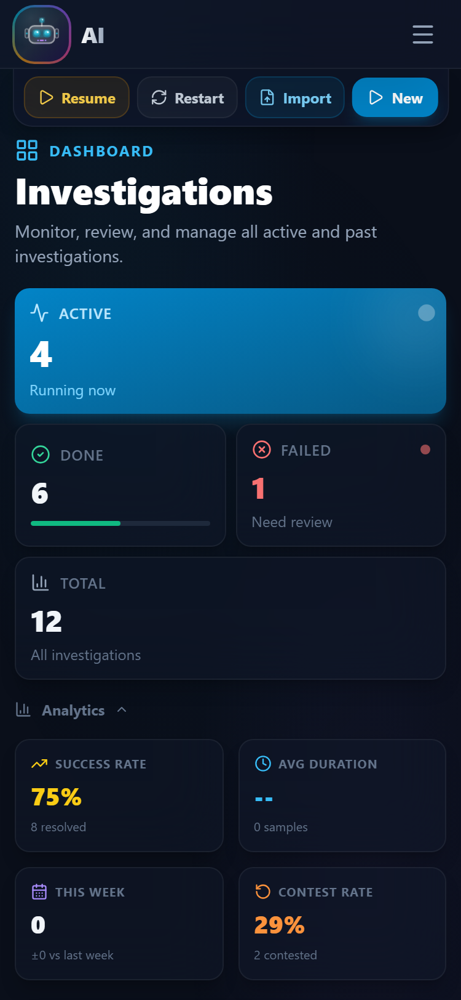 | 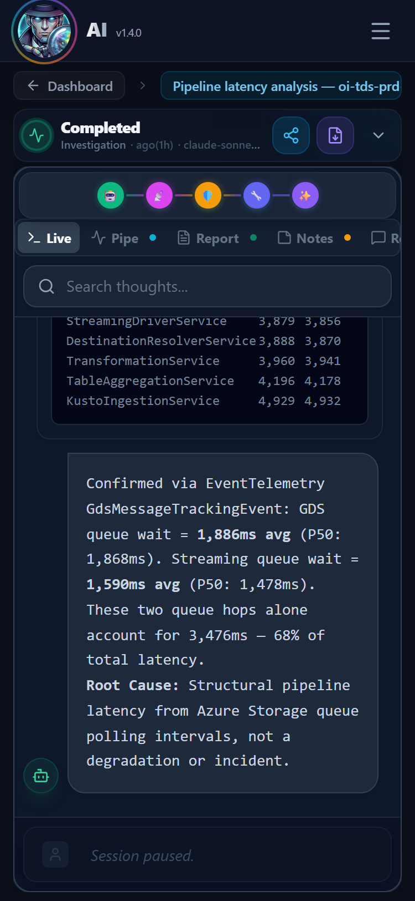 | 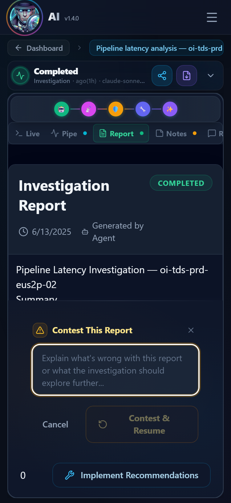 |

</div>

### Managing Remote Investigations

With remote access, you can run the AI Investigator on your work laptop and manage investigations from anywhere on your personal device:

1. **Start the dashboard** on your laptop: `.\Run-Dashboard.ps1`
2. **Copy the tunnel URL** from the console window that opens
3. **Open the URL** on your phone, tablet, or any browser
4. **Sign in** with your Microsoft account (tenant mode) or access directly (anonymous mode)

From your phone you can:
- Monitor live investigation progress in real-time via WebSocket streaming
- Start new investigations with stamp, time range, and issue type
- Pause, resume, or abort running investigations
- Read final reports and contest findings with feedback
- Review retrospective proposals and apply knowledge base changes
- Switch between investigations on the dashboard

The tunnel stays active as long as your laptop is running. Close it with `Stop-Dashboard.ps1` or by shutting the tunnel console window.

Configuration is managed through the Settings UI or directly in `backend/config.json` (copy from `config.sample.json` to get started):

| Setting | Default | Description |
|---------|---------|-------------|
| `repoRoot` | Auto-detected | Absolute path to your repository root. All relative paths resolve from here |
| `model` | `gpt-4o` | Default LLM model for new investigations |
| `maxSteps` | `50` | Max reasoning steps before auto-pause (0 = unlimited) |
| `systemPromptPath` | *(empty)* | Path to the agent's system prompt `.md` file |
| `knowledgeBasePath` | *(empty)* | Repo-relative path to the knowledge base directory (e.g., `docs/investigations`). Used by retrospective for doc discovery |
| `investigationsPath` | `<repoRoot>/investigations` | Where investigation artifacts (JSON + Markdown) are saved |
| `defaultTimeRange` | `ago(1h)` | Default KQL time range preset |
| `maxConcurrentInvestigations` | `3` | Maximum parallel investigations |
| `autoRefreshInterval` | `30` | Dashboard refresh interval (seconds) |
| `workingDirectory` | Backend CWD | Working directory for file operations |
| `retrospectTimeoutMinutes` | `10` | Timeout in minutes for retrospective auto-analysis (0 = unlimited) |
| `notifications` | `true` | Enable toast notifications when investigations complete or fail |
| `mcpServers` | `[]` | MCP server configurations for KQL fallback backend |
| `theme` | `light` | UI theme preference |
| `products` | `[]` | Array of product configurations (see Multi-Product Support) |
| `activeProductId` | *(empty)* | ID of the currently selected product for new investigations |

### Product Configuration

Each product in the `products` array has:

| Field | Description |
|-------|-------------|
| `id` | Unique identifier (auto-generated from name) |
| `name` | Display name for the product |
| `repoRoot` | Repository root path for this product |
| `systemPromptPath` | Path to agent system prompt |
| `knowledgeBasePath` | Path to knowledge base directory |
| `workingDirectory` | Working directory for file operations |
| `investigationsPath` | Where investigation artifacts are saved |

---

## API Reference

### Investigations

| Method | Endpoint | Description |
|--------|----------|-------------|
| `POST` | `/api/investigations` | Start new investigation |
| `GET` | `/api/investigations` | List all investigations |
| `GET` | `/api/investigations/:id` | Get investigation state |
| `GET` | `/api/investigations/:id/steps/:index` | Lazy-load full step details |
| `POST` | `/api/investigations/:id/action` | Pause / Resume / Abort / Intervene / Contest |
| `POST` | `/api/investigations/:id/model` | Switch model mid-investigation |
| `POST` | `/api/investigations/:id/compact` | Summarize history to reduce tokens |
| `DELETE` | `/api/investigations/:id` | Delete investigation (memory + disk) |
| `PATCH` | `/api/investigations/:id/title` | Rename investigation title |
| `GET` | `/api/investigations/:id/export` | Export investigation as portable JSON |
| `POST` | `/api/investigations/import` | Import investigation from exported JSON |
| `GET` | `/api/investigations/:id/pdf` | Export final report as styled PDF (Puppeteer) |

### Retrospective

| Method | Endpoint | Description |
|--------|----------|-------------|
| `POST` | `/api/investigations/:id/retrospect` | Send chat message |
| `POST` | `/api/investigations/:id/retrospect/analyze` | Trigger auto-analysis |
| `POST` | `/api/investigations/:id/retrospect/abort` | Cancel running analysis |
| `PATCH` | `/api/investigations/:id/retrospect/proposals/:pid` | Approve / Reject proposal |
| `POST` | `/api/investigations/:id/retrospect/apply` | Apply all approved proposals |
| `POST` | `/api/investigations/:id/retrospect/complete` | Mark complete / Reopen |

### Products

| Method | Endpoint | Description |
|--------|----------|-------------|
| `GET` | `/api/products` | List all configured products |
| `POST` | `/api/products` | Add a new product |
| `GET` | `/api/products/active` | Get the currently active product |
| `PUT` | `/api/products/active` | Set the active product |
| `GET` | `/api/products/discover?repoRoot=` | Discover product config from `.investigator.json` or repo structure |
| `PUT` | `/api/products/:id` | Update a product |
| `DELETE` | `/api/products/:id` | Delete a product |
| `GET` | `/api/products/:id/validate` | Validate product paths (existence, absolute path check) |
| `POST` | `/api/products/:id/clone` | Clone a product configuration |

### Schedules

| Method | Endpoint | Description |
|--------|----------|-------------|
| `GET` | `/api/schedules` | List all schedules (with scheduler status) |
| `POST` | `/api/schedules` | Create a new schedule |
| `PUT` | `/api/schedules/:id` | Update a schedule |
| `DELETE` | `/api/schedules/:id` | Delete schedule + cascade-delete investigations |
| `POST` | `/api/schedules/:id/run-now` | Trigger an immediate run |
| `POST` | `/api/schedules/:id/enable` | Enable a schedule |
| `POST` | `/api/schedules/:id/disable` | Disable a schedule |
| `GET` | `/api/schedules/:id/history` | Get run history for a schedule |
| `POST` | `/api/scheduler/start` | Start the scheduler engine |
| `POST` | `/api/scheduler/stop` | Stop the scheduler engine |
| `GET` | `/api/scheduler/status` | Check if the scheduler is running |

### Query Bank

| Method | Endpoint | Description |
|--------|----------|-------------|
| `GET` | `/api/query-bank` | List all saved queries |
| `POST` | `/api/query-bank` | Create a saved query |
| `PUT` | `/api/query-bank/:id` | Update a saved query |
| `DELETE` | `/api/query-bank/:id` | Delete a saved query |

### Auth & System

| Method | Endpoint | Description |
|--------|----------|-------------|
| `GET` | `/api/auth/status` | Check GitHub authentication status |
| `POST` | `/api/auth/login` | Start GitHub OAuth device flow |
| `POST` | `/api/auth/poll` | Poll OAuth device flow status (`{ device_code }`) |
| `GET` | `/api/auth/user` | Get authenticated GitHub user profile |
| `POST` | `/api/auth/azure-login` | Spawn Azure CLI login in terminal window |
| `GET` | `/api/auth/azure-status` | Check Azure CLI authentication status |
| `GET` | `/api/health` | Health check endpoint |
| `GET` | `/api/me` | Get OS username |
| `GET` | `/api/models` | List available LLM models |
| `GET/POST` | `/api/settings` | Get / Save configuration |
| `GET` | `/api/files/list` | Browse server filesystem |

### ICM

| Method | Endpoint | Description |
|--------|----------|-------------|
| `GET` | `/api/icm/status` | Check ICM scripts availability |
| `POST` | `/api/icm/:incidentId/read` | Fetch IcM incident via SSE streaming (120s timeout) |

### MCP

| Method | Endpoint | Description |
|--------|----------|-------------|
| `GET` | `/api/investigations/:id/mcp/status` | Check MCP KQL server status |
| `POST` | `/api/investigations/:id/mcp/restart` | Restart MCP KQL server |

### WebSocket

Connect to `ws://localhost:3000/ws?id=<investigationId>` for real-time event notifications. Events are lightweight signals — the frontend fetches full state via REST after receiving them (debounced at 300ms):

| Event Type | Description |
|------------|-------------|
| `thought` | Agent reasoning step |
| `action` | Tool call with arguments and results |
| `status` | Investigation state change |
| `log` | Internal log message |
| `retrospect` | Retrospective state update |
| `retrospect-proposal` | New proposal created |
| `retrospect-tool-activity` | Retrospective agent reading/analyzing files |

---

## Tech Stack

| Layer | Technology |
|-------|-----------|
| **Frontend** | React 19 · TypeScript · Vite 7 · Tailwind CSS · React Router · lucide-react · react-markdown · remark-gfm |
| **Backend** | Node.js · Express · TypeScript · WebSocket (ws) · Puppeteer · OpenAI SDK · @modelcontextprotocol/sdk · axios |
| **LLM** | GitHub Copilot API (OAuth device flow) — GPT-4o, Claude Opus 4.6, etc. |
| **KQL** | Kusto CLI (primary) · MCP KQL Server (fallback) |
| **Auth** | GitHub OAuth Device Flow · Azure CLI for Kusto |
| **Persistence** | JSON state files · Markdown reports |

---

## Project Structure

```
.
├── .investigator.json                # Product manifest for one-click onboarding
└── tools/InvestigationDashboard/
    ├── README.md                     # This file
    ├── Run-Dashboard.ps1             # Launch services + dev tunnel (-NoTunnel, -Anonymous, -Classic)
    ├── Setup-Dashboard.ps1           # Install dependencies + Kusto CLI + Playwright + devtunnel check
    ├── Stop-Dashboard.ps1            # Kill dashboard + tunnel processes
    ├── prompts/
    │   └── RetrospectPrompt.md       # Retrospective prompt template
    ├── scripts/
    │   ├── icm/                       # Bundled ICM automation scripts (Playwright)
    │   └── screenshots/               # Automated screenshot capture (see Taking Screenshots)
    ├── backend/
    │   ├── config.json               # Runtime configuration (git-ignored, user-specific)
    │   ├── config.sample.json        # Template config for new setups
    │   ├── .gitignore                # Ignores config.json + build artifacts
    │   ├── src/
    │   │   ├── server.ts             # Express + WebSocket server
    │   │   ├── pdfRenderer.ts        # PDF report generation (Puppeteer + Markdown)
    │   │   ├── agent/
    │   │   │   ├── Runner.ts         # Core agent loop + retrospective
    │   │   │   ├── CopilotClient.ts  # GitHub OAuth + token management
    │   │   │   ├── Tools.ts          # KQL execution (Kusto CLI + MCP)
    │   │   │   └── RetrospectAgent.ts # (Legacy placeholder)
    │   │   ├── schedules/
    │   │   │   ├── Scheduler.ts      # Recurring investigation scheduler engine
    │   │   │   └── ScheduleStore.ts  # Persistent schedule definitions + history
    │   │   └── querybank/
    │   │       └── QueryBankStore.ts  # Saved query template storage
    │   └── trigger_inv.js            # Dev utility: test investigation trigger
    ├── frontend/
    │   ├── public/
    │   │   └── favicon.svg           # Custom AI Investigator icon
    │   └── src/
    │       ├── App.tsx               # Router configuration (/, /new, /investigation/:id, /schedules, /settings, /about)
    │       ├── api.ts                # API client (all endpoints)
    │       ├── constants.ts          # Time presets + schedule intervals + investigation modes
    │       ├── types/
    │       │   ├── index.ts          # Core type definitions
    │       │   ├── product.ts        # Product type definitions
    │       │   └── schedule.ts       # Schedule + history type definitions
    │       ├── components/
    │       │   ├── Layout.tsx        # App shell, nav, auth, branding
    │       │   ├── FileBrowserModal.tsx
    │       │   ├── Toast.tsx         # Toast notifications + confirm dialogs
    │       │   └── charts/           # Dashboard analytics (recharts)
    │       │       ├── InvestigationTrend.tsx    # Line chart of investigations over time
    │       │       ├── IssueTypeDonut.tsx        # Issue type distribution donut
    │       │       ├── DurationDistribution.tsx  # Duration histogram
    │       │       └── SuccessRateDonut.tsx      # Success rate pie chart
    │       └── pages/
    │           ├── Dashboard.tsx         # Investigation cards grid/list + analytics charts
    │           ├── NewInvestigation.tsx   # Investigation launch form (Standard + ICM) + query bank
    │           ├── InvestigationDetail.tsx  # Live session + Report + Retrospect
    │           ├── Schedules.tsx         # Schedule list with verdicts + history + inline editing
    │           ├── ScheduleForm.tsx      # Schedule creation/edit wizard
    │           ├── Settings.tsx          # Configuration management (4 tabs)
    │           └── About.tsx             # Feature showcase + credits
    └── docs/
        └── screenshots/              # UI screenshots (see Visual Walkthrough)
```

---

## Taking Screenshots

All README screenshots are generated automatically using **Playwright** with a mock API server — no real backend, Kusto connection, or Azure auth required. The system uses **mock state injection**: an Express server serves canned JSON fixtures while Playwright navigates the real frontend through every page and state.

### Prerequisites

- **Node.js** ≥ 18
- **Frontend dependencies** already installed (`cd frontend && npm install`)

### Quick Start

```bash
# First time only — install screenshot tool dependencies + Chromium
cd tools/InvestigationDashboard/scripts/screenshots
npm install
npx playwright install chromium

# Generate all 18 screenshots
npm run capture
```

### What Happens

1. A mock Express + WebSocket server starts on port **3099** serving canned investigation fixtures
2. A Vite dev server starts on port **5174** with `VITE_API_URL=http://localhost:3099/api` — so the frontend talks to the mock server instead of the real backend
3. Playwright launches a headless Chromium browser (1400×900 viewport, 2× device scale for Retina-quality PNGs, dark color scheme)
4. For each of the 18 screenshots, the capture script:
   - Calls the mock server's `/__control/*` endpoints to swap in the right fixture data
   - Navigates to the correct route (`/`, `/new`, `/investigation/:id`, `/settings`, etc.)
   - Waits for animations to settle (`reducedMotion: 'reduce'` + timeouts)
   - Captures  the screenshot to `docs/screenshots/`
5. Everything shuts down cleanly (browser, Vite, mock server)

> **Port choice**: Ports 3099/5174 are used intentionally to avoid conflicts with the real backend (port 3000) and frontend dev server (port 5173) if they're running.

### Commands

| Command | Description |
|---------|-------------|
| `npm run capture` | Full run — starts mock server + Vite, captures all 19 screenshots |
| `npm run capture:headed` | Same, but with a visible browser window (useful for debugging) |
| `npm run capture:no-vite` | Skip starting Vite — use when you already have Vite running on port 5174 |
| `npm run mock-server` | Run only the mock API server (for manual UI exploration at `http://localhost:3099`) |

### Screenshot Inventory

The capture script produces these 29 files in `docs/screenshots/`:

| # | File | Page / State |
|---|------|-------------|
| 1 | `dashboard-overview.png` | Dashboard — main grid overview |
| 2 | `dashboard.png` | Dashboard — mixed investigation statuses |
| 3 | `dashboard-resume-all.png` | Dashboard — post-restart with Resume All button |
| 4 | `new-investigation.png` | New Investigation form (filled) |
| 5 | `investigation-start.png` | Investigation detail — early running state |
| 6 | `live-session.png` | Investigation detail — multi-step with tool calls |
| 7 | `paused-by-user.png` | Investigation detail — paused state |
| 8 | `user-intervention.png` | Investigation detail — intervention input filled |
| 9 | `token-alert.png` | Investigation detail — token limit warning banner |
| 10 | `final-report.png` | Investigation detail — Report tab with Markdown report |
| 11 | `Consent-report.png` | Investigation detail — Contest form with feedback |
| 12 | `investigation-consent-resume.png` | Investigation detail — Live tab post-contest |
| 13 | `failed-investigation.png` | Investigation detail — failed state |
| 14 | `retrospective-analysis.png` | Retrospective tab — analyzing state |
| 15 | `retrospective-analyze-investigation.png` | Retrospective tab — analysis complete |
| 16 | `proposals-panel.png` | Retrospective tab — expanded proposals |
| 17 | `retrospective-chat.png` | Retrospective tab — follow-up conversation |
| 18 | `settings.png` | Settings — Products tab expanded |
| 19 | `auth-flow.png` | Unauthenticated state |
| 20 | `mobile-dashboard.png` | 📱 Dashboard — phone viewport (375×812) |
| 21 | `mobile-investigation-detail.png` | 📱 Investigation detail — compact sidebar |
| 22 | `mobile-contest-report.png` | 📱 Contest report — phone layout |
| 23 | `mobile-new-investigation.png` | 📱 New Investigation form — phone layout |
| 24 | `mobile-settings.png` | 📱 Settings — horizontal tab bar |
| 25 | `share-export-buttons.png` | Investigation detail — Share & PDF export buttons |
| 26 | `drag-drop-import.png` | Dashboard — drag-and-drop import overlay |
| 27 | `schedules.png` | Schedules — schedule list with verdicts + scheduler dock |
| 28 | `schedule-form.png` | Schedule creation wizard with query bank |
| 29 | `query-bank.png` | New Investigation — query bank dropdown |

### Architecture

```
scripts/screenshots/
├── package.json           # Dependencies: playwright, express, ws
├── mock-server.js         # Express + WebSocket mock API (port 3099)
├── capture.js             # Playwright orchestration (26 screenshot functions)
└── fixtures/              # Canned JSON responses
    ├── investigations.json           # Dashboard card list (10 investigations)
    ├── investigations-all-paused.json # Post-restart state (3 paused + 2 completed)
    ├── investigation-running.json    # Early-stage running investigation
    ├── investigation-paused.json     # Paused investigation with cache miss findings
    ├── investigation-live-session.json  # Multi-step running with user intervention
    ├── investigation-completed.json  # Completed with full final report (DLQ overflow)
    ├── investigation-contested.json  # Post-contest resumed investigation
    ├── investigation-failed.json     # Failed due to auth error
    ├── investigation-retrospect.json # Retrospective with proposals (4 proposals)
    ├── investigation-retrospect-chat.json  # Retrospective with follow-up chat
    └── settings.json                 # Settings, models, products, validations
```

### Customizing Screenshots

- **Fixture data**: Edit JSON files in `fixtures/` to change investigation content, thought messages, KQL queries, and report text. The structure matches the API interfaces in [frontend/src/api.ts](frontend/src/api.ts)
- **Viewport**: Change `VIEWPORT` in `capture.js` (default: 1400×900, matching the dashboard's Edge app mode)
- **Adding screenshots**: Add a new `capture*` function in `capture.js` and call it from `main()`. Use `setDetailOverride(id, fixture)` to inject state before navigating
- **Mock server control API**: The `/__control/*` endpoints (`reset`, `set-investigations`, `set-detail-override`, `set-auth`) swap fixture data at runtime between captures
- **Retaking after UI changes**: Just run `npm run capture` — it's designed to be idempotent and will overwrite existing PNGs

---
